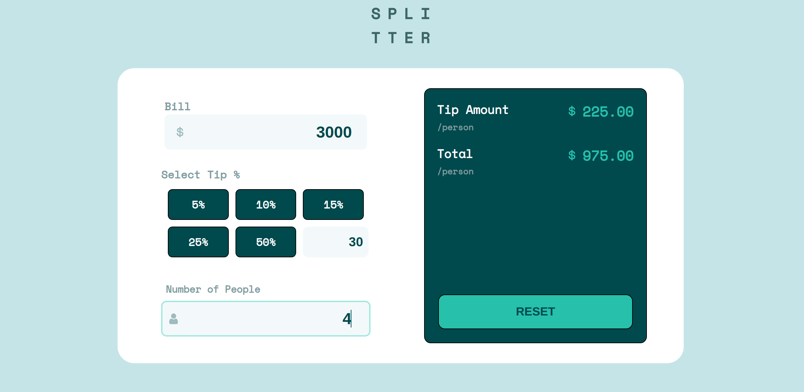

# Frontend Mentor - Tip calculator app solution

## Welcome! 👋

This is a solution to the [Tip calculator app challenge on Frontend Mentor](https://www.frontendmentor.io/challenges/tip-calculator-app-ugJNGbJUX). 

### The challenge

Users should be able to:

- View the optimal layout for the app depending on their device's screen size
- See hover states for all interactive elements on the page
- Calculate the correct tip and total cost of the bill per person

### The design to be implemented

### Screenshot of my implementation

### Built with

* Semantic HTML5 markup
* Javascript
* Flexbox
* CSS Grid
* Mobile-first workflow

### Useful resources

- [Working with SVG images](https://stackoverflow.com/questions/22252472/how-to-change-the-color-of-an-svg-element) 

